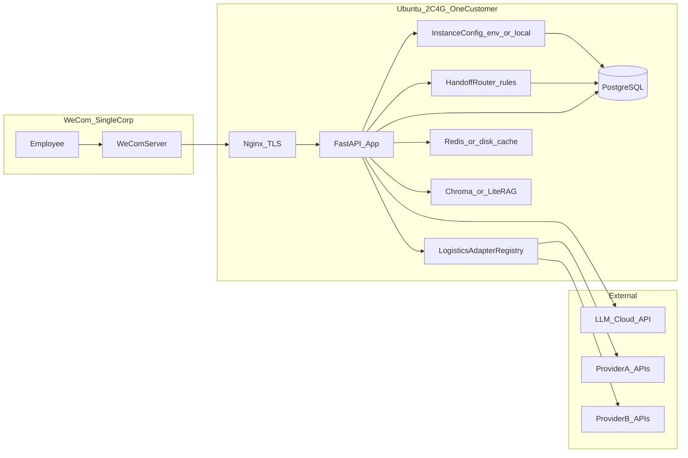

# 企业微信国际物流智能机器人：需求文档框架 + 2C4G Python 技术方案

> 本文件为仓库内归档副本；与 Cursor 全局 `plans` 目录中的同名计划保持同步时，以本路径为准。

## 一、需求文档建议结构（可直接落地为 SRS / PRD）

以下各节标题可作为正式文档目录；括号内为你在本项目中应写明的要点。

### 1. 引言

- **目的**：通过企业微信机器人承接询价、轨迹等高频问题，减少人工、提高响应一致性；无法回答的问题进入改进闭环。
- **范围**：首期（MVP）与后续扩展（下单、问题件、运单号映射等）分阶段说明，避免一期范围失控；**部署形态首期明确为「单租户独立部署」**（一套软件进程只服务一家企业客户，无跨客户数据共存）。
- **术语**：违禁品筛查、查价要素、订单号、运单号、知识库、RAG、人工抽检、**物流商适配器**、**转人工兜底**、**客服路由规则**（意图 / 部门 / 关键词 → 企微成员）等；「租户」一词可在对外商务仍指「客户」，但技术首期不按多租户 SaaS 建模。

### 2. 角色与场景

- **角色**：内部员工（主用户）、**系统管理员**（配置本实例的企业微信应用、LLM、物流商通道、话术、**人工客服路由与默认客服**）、**人工客服**（企微通讯录中的成员，接收转接；可按报价/售前/售后等分工）、客服/运营（处理未答问题与抽检）、企业微信、**可插拔的物流业务系统**（查价/轨迹等 API，按本实例配置切换）；**平台超级管理员**仅在将来「单机多租户 SaaS」阶段引入，**首期不写进范围**。
- **典型场景**（建议写成用户故事 + 验收标准）：
  - 询价：自然语言 → 违禁品判断 → 要素抽取 → 调内部查价 API → 结构化回复。
  - 轨迹：识别订单号 → 调轨迹 API → 状态/节点摘要回复。
  - 未命中或系统拒答：写入未答工单 → **按规则展示转人工入口**（见 3.11），员工可一键发起与对应客服的**单聊**；同时可选文案「已记录」类提示（产品二选一）。

### 3. 功能需求（按模块编号，便于评审与测试用例映射）

**3.1 企业微信接入**

- 接收消息（文本为主；后续可列图片/文件为 Out of Scope 或二期）。
- 被动回复时效、加解密（企业微信回调 URL 校验、消息加解密）、access_token 缓存与刷新策略。
- 会话维度：单聊/群聊是否支持（若仅单聊，明确写死）。

**3.2 对话编排与意图路由**

- 将用户输入分类为：`询价`、`轨迹`、`售前咨询`、`售后问题`、`其他/闲聊/模糊`（枚举可配置扩展，并与 **3.11 客服路由** 对齐）。
- 模糊意图：澄清一轮（可选）或直接走「未答记录 + 转人工兜底」策略（产品二选一，文档里写死规则）。
- **与转人工联动**：意图识别结果、可选的「部门/业务线」标签（若员工身份或关键词可推断）作为 **客服路由的输入维度**。

**3.3 违禁品与合规筛查（首期核心规则）**

- **输入**：用户原始问题 + 可选从知识库检索到的品类说明。
- **输出**：`通过` / `不通过` + **可展示给员工**的拒绝原因（避免泄露内部敏感规则细节的可配置话术）。
- **知识来源**：违禁品清单、反倾销品类表、液体/粉末等规则（结构化表 + 简短政策说明文档）。
- **终止行为**：不通过时**不调**查价 API，仅返回温馨提示（你已描述，写进验收标准）。

**3.4 询价要素抽取与校验**

- **必选字段**（与你示例对齐，可扩展）：起运地、目的地、是否带电、实重、长宽高、件数；可加「品名/材质」「贸易条款」「时效要求」等若业务需要。
- **校验**：数值范围、单位统一（cm/kg）、件数与体积重逻辑（若业务有公式，写明由业务系统算还是机器人算）。
- **缺失处理**：列出缺哪些字段、用企业微信可读的模板追问（最多 N 轮，N 在文档中定义）。

**3.5 内部系统集成（可配置 / 多物流商）**

- **抽象**：所有查价、轨迹、后续下单等能力，统一通过 **「物流商适配器」** 调用；不同物流商实现不同 **endpoint、鉴权方式、请求/响应映射**；需求文档中写清 **适配器契约**（入参统一为内部标准 DTO，出参统一为机器人展示模型）。
- **查价 API**（每物流商可不同）：映射到标准字段后的超时、错误码、重试策略（429/5xx）、脱敏日志是否记录请求体。
- **轨迹 API**：同上；订单号格式校验支持 **按物流商配置**（正则/长度）。
- **鉴权**：API Key、OAuth2、mTLS 等作为适配器配置项；附录中按物流商给出示例，安全策略由运维定稿。

**3.6 知识库与模型协同**

- **知识库内容**：违禁规则摘要、常见线路说明、包装要求、FAQ。
- **检索增强（RAG）**：用于违禁判断辅助与通用问答；与「结构化查价」分流：查价仍以要素抽取 + API 为准，避免模型直接编造价格（**验收：价格必须来自 API**）。

**3.7 未回答问题闭环（你强调的能力）**

- **记录字段**（建议最低集）：时间、企业微信 userId、会话 id、用户原文、识别意图、模型/规则中间结果、是否已调 API、API 错误信息、处理状态（待处理/已回复/已入库）；**转人工时追加**：触发的兜底原因码、`route_rule_id`、**指派客服企微 userid**、是否已点击/是否已会话（若技术上可统计则记，否则可省）。
- **后台能力**：列表筛选、导出、关联「标准答案」后写入知识库或训练样本库（首期可「人工粘贴答案入库」，不必上一键训练）；可按「已转人工」筛选便于质检。
- **权限**：仅管理员/指定角色可查看全量内容（含隐私与商业敏感）。

**3.8 非功能需求（2C4G 上要写清楚）**

- **并发**：预期同时在线会话数、峰值 QPS（例如 5～20 即可显著影响架构）。
- **可用性**：单实例部署下的重启策略、健康检查。
- **安全**：密钥不入库明文、HTTPS、企业微信可信 IP、操作审计。
- **合规**：对话与订单数据保留周期、脱敏规则。

**3.9 后续扩展（单独「路线图」章节，不作为首期验收）**

- 物流下单（要素与询价类似，增加服务类型、保险等）。
- 问题件查询、订单号 → 国际运单号映射等——各列独立 API 与意图。

**3.10 产品化与可配置（首期 = 单租户独立部署）**

- **商业目标**：同一套软件可 **打包售卖给多家客户**；每家客户在 **独立 VPS 上部署一套实例**，对接 **该客户自己的一个企业微信应用** 与 **一家或多家物流商 API**（自研 TMS 或第三方）；客户之间数据天然隔离（不同机器、不同库）。
- **首期定稿（SRS 写死）**：仅 **单租户独立部署**；不在首期实现「同一进程、同一库服务多家企业」的多租户 SaaS。
- **路线图（非首期验收）**：**单机多租户 SaaS**（按企微 CorpId/AgentId 路由、`tenant_id`、配额、库内密钥加密等）可在产品有稳定付费与运维能力后再立项。
- **可配置项（实例级，建议列表化进 SRS）**：
  - 企业微信：**管理后台**配置接收消息服务器 URL、Token、EncodingAESKey 等；应用侧以 **`corp_id`、应用 `secret`、`agent_id`（若适用）、与后台一致的 Token/EncodingAESKey** 写入 `.env`（字段名以实现文档为准）；可信域名与公网 HTTPS 由运维保障。
  - LLM（**云端 API**）：**可配置 `base_url`（兼容 OpenAI 协议的 API 根地址）**、**`api_key`**、模型名、温度与 max_tokens 上限；支持客户自带 Key；**不入库**时以环境变量 / `.env` 为主。
  - 物流通道：启用哪些 **适配器**、每通道的 base_url、鉴权字段、超时与重试、**响应字段映射**（若对方 JSON 与内部 DTO 不一致）。
  - 话术与规则：违禁提示语、免责声明、品牌展示名（机器人对外名称）。
  - **人工客服路由**：`handoff_default`、`handoff_rule`（关键词 / **org_unit** / 意图）、**`staff_org_map`（员工 userid → org_unit_code，自建）**、匹配顺序与优先级（与 **3.11**、技术方案 **§4** 一致，可存库或 YAML）。
  - 知识库：本实例专用（首期无需表前缀隔离；若库表预留 `tenant_id` 仅作将来扩展可选，不作为首期开发项）。
- **管理界面**：系统管理员维护本实例配置、**客服路由规则**、知识库、未答工单即可。
- **产品交付物**：安装文档、默认 `docker-compose` 或 systemd 部署、**配置备份/恢复**、版本升级说明；可选 **License**（安装包 + 授权文件）若商业需要，在需求中单列为非功能或商务条款。
- **验收（首期）**：同一实例内切换/启用物流商适配器后，询价与轨迹命中正确 API 与映射；配置缺失或错误时提示明确（响应中不回显密钥）；**不要求**多 Corp 同机路由、**不要求**日志带 `tenant_id`。

**3.11 人工兜底与可配置客服路由**

- **目标**：当系统**无法回答**、**达到澄清上限仍要素不全**、**业务 API 明确失败或无法报价**、或管理员定义的其他触发条件时，在机器人对话界面给出 **转人工路径**：员工可 **点击后与对应企微客服成员发起单聊**（产品表述：「客服名片 / 联系人入口」）。
- **可配置维度（实例级，后台或配置文件维护）**：
  - **按意图路由**：例如 `询价` → 市场/报价负责人；`轨迹` / `售后问题` → 售后客服；`售前咨询` → 售前客服；`其他` → 默认客服组或默认个人。
  - **按「业务线 / 部门」路由（首期定稿：自建映射表，见下）**：**不依赖**企微通讯录部门结构（避免客户组织树与「报价/售前/售后」口径不一致）；由客户在后台维护 **`wecom_userid` → `org_unit_code`**（可多行表示一人多岗），`org_unit_code` 为客户自定义枚举（如 `MARKET_QUOTE`、`PRESALES`、`AFTERSALES`）。路由规则中配置 **`org_unit_code` → 目标客服 `userid` 列表**；若发送者未出现在映射表中，则 **跳过本层**，仅走意图与默认。
  - **按关键词（可选）**：如命中「投诉」「理赔」等优先转售后负责人。
  - **默认客服**：无任何规则命中时的兜底成员（必填，避免无人可转）。
- **匹配顺序（SRS 写死，建议）**：`关键词规则`（命中即停）→ `org_unit_code`（由当前发言员工 userid 查映射表，再匹配 org 类规则）→ `意图规则` → `默认客服`。同层多条规则时按 **显式 priority 数值** 从小到大排序，首条命中生效。
- **客服人员模型**：每条规则绑定 **一个或多个企微成员**（`userid`）；若多人，产品可定为「展示列表任选其一」或「主负责人 + 备用」（SRS 写死一种）。
- **触发策略**：与 3.7 未答闭环一致——转人工与记工单 **可并行**（先记工单再推名片，或仅记工单，由产品定）；**不得**在未触发兜底时频繁打扰用户（限制同一会话短时间内重复转人工次数，可在非功能中写阈值）。
- **企微呈现（重要：技术附录）**：不同企微应用类型（自建应用、第三方应用、智能机器人等）对 **被动回复可发送的 msgtype** 能力不同。SRS **验收**写「用户能在客户端内完成与指定成员单聊的闭环」；**实现方式**在《企微接入附录》中单独立项调研并定稿，候选包括（不限于）：官方支持的 **文本/图文 + 可打开的单聊链接**、**跳转指定成员的 URL scheme**（若当前版本支持）、或 **客服专员 / 联系我** 类组件——**以对接时企业微信开放文档为准**，避免在 SRS 正文中写死尚未核实的消息类型名称。
- **验收（首期）**：配置「询价→用户 A、售后→用户 B、默认→用户 C」后，模拟三类提问分别落到正确成员；**同一员工**在映射表中标记为 `PRESALES` 时，兜底转人工应落到售前规则对应客服；无映射且无意图命中时落到默认客服；规则配置错误（userid 不存在）时有降级提示与运维告警（日志）。

### 4. 验收标准（每条功能对应 Given-When-Then）

至少覆盖：违禁拦截不调价、非违禁完整要素成功查价、轨迹成功/订单不存在、API 超时友好提示、未答入库可检索；**产品化（单租户）**：实例配置错误时的明确诊断（不落密钥）、多物流商适配器切换或双通道并行行为符合文档定义；**转人工**：系统无法回答时，用户收到含可点击转接入口的回复，且路由到配置的正确客服；默认规则与优先级符合 3.11 文档。

---

## 二、硬件现实约束（2 核 CPU / 4G 内存 / 500G 盘）

- **4G RAM 不适合**同时自托管大参数 LLM（如 7B 级全量常驻）+ 向量库 + 应用 + 数据库；若坚持本地大模型，需接受频繁 OOM 或 swap 导致延迟，**不推荐作为 MVP**。
- **合理策略**：**应用与数据在自有服务器**；**大模型以云端 API 为主**（按量计费）；本地仅跑轻量逻辑与可选小模型（见下「可选」）。
- **500G 盘**：足够存日志、PostgreSQL、向量索引、附件（若二期）；磁盘不是瓶颈。

### 2.1 环境与版本（项目方定稿）

| 项 | 定稿 |
|----|------|
| **Python** | 本地开发 **3.13.9**；生产机（Ubuntu 24.04）安装 **Python 3.13.x**（与开发同大版本，建议对齐 minor），用 `uv.lock` / `requirements.txt` 锁依赖。 |
| **数据库** | **PostgreSQL** 作为 MVP 主库（工单、路由配置、会话审计等）；与 SRS 一致。 |
| **大模型** | **云上 API**；通过 **`LLM_BASE_URL`（或等价项）+ `LLM_API_KEY`** 等配置接入兼容 OpenAI 协议的网关（通义/豆包/智谱/自建代理等）。 |
| **企微** | 你在企微后台填写 **URL、Token、EncodingAESKey**；应用进程从 **`.env` / 环境变量** 读取同源配置，**禁止**将密钥提交到 Git。 |

---

## 三、推荐技术方案（Python 生态，适配当前服务器）

### 1. 总体架构

**产品化要点（首期）**：进程启动或首次请求时从 **环境变量 / `.env` / 本地配置表** 加载 **唯一实例配置**（一套企微、一套 LLM、多物流适配器列表）；`LogisticsAdapterRegistry` 按实例配置实例化 **策略类或插件模块**（同一接口 `quote` / `track`）；`HandoffRouter` 加载 **客服路由规则表**（意图 / 部门 / 关键词 → `userid` 列表 + 默认客服），在兜底分支生成 **转人工消息载荷**。**不做** 回调内多 Corp 路由。

- **入口**：企业微信 → 公网 HTTPS → **Nginx**（TLS、限流、可选 IP 白名单）→ **FastAPI** 应用。
- **编排**：单进程 **Uvicorn**（2 核下 worker 数建议从 1 起步，按压测再加，避免内存复制过多）；CPU 密集任务避免阻塞事件循环，少量阻塞用 **线程池**。
- **配置与密钥**：首期以 **环境变量 + `.env`**（或安装向导写入单次配置文件）为主；若管理后台支持在线改密钥，再要求 **库内加密**（路线图）；生产可用 **systemd** 托管进程。
- **转人工实现**：路由引擎为 **纯规则引擎**（有序规则 + 默认），与 LLM 解耦，避免「乱指客服」；客服成员以 **企微 `userid`** 为稳定主键；上线前在客户企微中 **校验 userid 与可见性**（客户是否已添加该客服为联系人等，以企微规则为准）。
- **物流商扩展**：Python 包内 **抽象基类** + 每物流商一个模块（或 entry_points 插件），新增物流商时尽量不修改核心编排代码，仅增适配器与配置 JSON/YAML。
- **2C4G**：每客户 **独立部署一套**；单进程单库，资源边界清晰，便于你方「卖一套装一套」的交付节奏。

### 2. 核心组件选型（理由简述）

| 层级        | 推荐                                                       | 说明                                                 |
| --------- | -------------------------------------------------------- | -------------------------------------------------- |
| Web 框架    | **FastAPI**                                              | 异步友好、类型注解、OpenAPI 自带，适合对接企微与内部 HTTP API。           |
| 企微 SDK    | **官方加解密 + 自写路由** 或成熟社区封装                                 | 重点验证回调与 token；选型以维护活跃度为准。                          |
| LLM 调用    | **OpenAI 兼容客户端**（如 `httpx` + 官方 SDK）                     | 便于切换国内云（通义/豆包/智谱等）的兼容网关。                           |
| 意图/要素     | **云端 chat 模型** + **JSON Schema / function calling** 约束输出 | 减少胡编；价格仍只信 API。                                    |
| 向量检索      | **Chroma** 嵌入式 或 **SQLite + 轻量 embedding**               | 4G 下控制 embedding 维度和索引规模；知识库条目初期可千级以内。             |
| Embedding | **云端 embedding API** 或 **极小规模本地模型**（可选）                  | 本地 `bge-small` 等约几百 MB～1G+，与 Redis/DB 同机需留余量。      |
| 缓存        | **Redis**（若可接受约百兆级常驻）或 **磁盘/内存 LRU** 缓存 token            | 企微 `access_token` 必缓存；无 Redis 也可用 SQLite/文件缓存 MVP。 |
| 主库        | **PostgreSQL**（定稿）                                         | 未答记录、审计、实例级适配器与 handoff 配置、异步任务状态。 |
| 后台队列（可选）  | **无需 Celery 起步**；必要时 **ARQ**（Redis）或 **轻量 SQLite 队列**    | 2C4G 上 Celery+多 worker 易占满内存。                      |
| 观测        | **结构化日志** + 可选 **Prometheus Node Exporter**              | 应用级 metrics 可后置。                                   |
| 部署        | **systemd + venv/uv**                                    | 容器可选，单机非必须。                                        |

### 3. 与「答不上来」相关的实现要点

- 定义明确阈值：`intent_confidence` 低、要素不全且达到追问上限、API 非业务错误、或业务返回「无法报价」等，统一映射为「未答工单」；**同一分支**调用 `HandoffRouter` 得到目标客服并组装回复。
- 表结构预留 `resolution`、`kb_entry_id`，支持后续与知识库条目关联；**客服路由**采用 **3.11 + 本节 §4 数据模型**（`staff_org_map`、`handoff_rule`、`handoff_default`），支持 YAML 导入作为低配替代。

### 4. 业务线与转人工路由数据模型（定稿：自建映射表）

- **`org_unit`（字典表，可选）**：`code`（主键，如 `PRESALES`）、`name`（展示用，如「售前」）、`sort_order`。也可首期写死在代码枚举，后台只维护映射与规则。
- **`staff_org_map`（员工 → 业务线/部门，核心）**：`wecom_userid`、`org_unit_code`、`is_primary`（bool，便于后台展示默认条线）；**同一员工多岗**时多行；`enabled`。
- **`handoff_rule`（路由规则）**：`rule_id`、`match_type`（`keyword` | `org_unit` | `intent`）、`match_value`（关键词子串、或 `org_unit_code`、或意图枚举值）、`target_userids`（JSON 数组或关联子表）、`priority`（整数，越小越优先）、`enabled`。
- **`handoff_default`（单例配置）**：`default_target_userids`（JSON），必填。
- **运行时输入**：回调中的 **发言员工** `userid`、当前 **意图**、原文 **用于关键词**；输出：`target_userids` 列表供组装转人工消息。
- **与企微通讯录的关系**：**首期不强制调用**「读取通讯录部门」API；若将来要做「从企微同步部门到 org_unit」可作为 **可选导入工具**，同步结果仍写入 `staff_org_map`，路由层不变。
- **运维**：提供 CSV/表格模板批量导入 `staff_org_map`；后台校验 `userid` 在本企业存在（定时任务调企微 **获取成员** 或批量拉取缓存通讯录，具体以权限与频率约束为准）。

### 5. 资源与扩容路径

- **MVP**：单机上 FastAPI + **PostgreSQL** + 云端 LLM；向量库可后置，违禁规则以**结构化表 + 少量 RAG** 即可。
- **业务量上升**：LLM 仍走云；应用层水平扩展需引入会话粘性或集中 session 存储；数据库迁 RDS。
- **强隐私/离线**：再评估独立 GPU 机或专用 API 区，与当前 2C4G 解耦。

---

## 四、文档交付物清单（你可要求乙方/内部按此输出）

1. 《软件需求说明》正文（含上述章节 + **接口附录** + **3.10 产品化（单租户）** + **3.11 转人工**）。
2. 《企业微信接入与安全说明》（**单企业、单应用回调**；含 **转人工消息形态调研结论**（可点击单聊的实现方式与限制）；与多 Corp 同机路由相关内容放入路线图附录即可）。
3. 《物流商适配器开发指南》：标准 DTO、错误码映射、示例适配器、如何注册新物流商。
4. 《客户交付与安装手册》：**单租户**单机部署、配置项清单、备份恢复、升级路径；**附录：`staff_org_map` / `handoff_rule` 说明与 CSV 批量导入模板**。
5. 《测试用例与验收记录模板》（含**多物流商适配器**切换用例；**转人工路由**（意图/部门/默认/错误配置降级）用例；跨客户数据隔离用「独立部署」验收，不要求同库 `tenant_id`）。
6. 《运维手册》：备份、日志轮转、密钥轮换、监控项。

---

## 五、实施前建议确认的产品决策（写入需求定稿）

1. **未命中时是否对员工展示「已记录」**：展示则体验好，但需接受略多无效记录。
2. **价格与轨迹信息的展示模板**：是否必须带免责声明（汇率波动、以系统为准等）。
3. **转人工与工单顺序**：先推转人工再记工单、或仅展示转人工不强调工单、或二者并列文案——需统一话术。
4. **部门 / 业务线维度（已定稿）**：采用 **自建 `staff_org_map`（userid → org_unit_code）** + `handoff_rule` 中 `match_type=org_unit`；**不绑定**企微组织树为唯一真相；企微通讯录同步仅作可选导入。若需「未维护映射的员工」一律走意图/默认，在 SRS 中写明。

若你补充「峰值并发、是否必须用本地大模型、内部 API 是否已有文档」，可在定稿需求中把非功能指标与接口附录写死，避免开发期反复变更。
